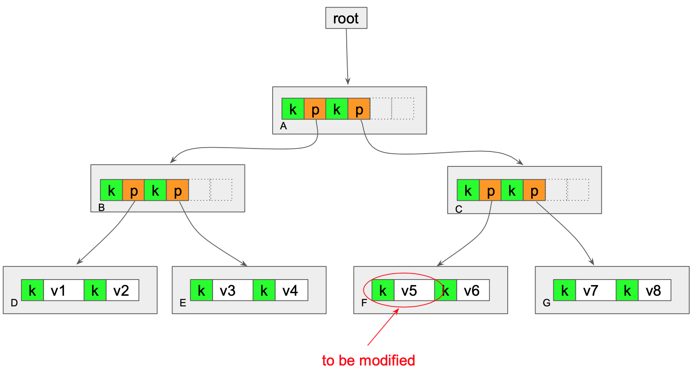
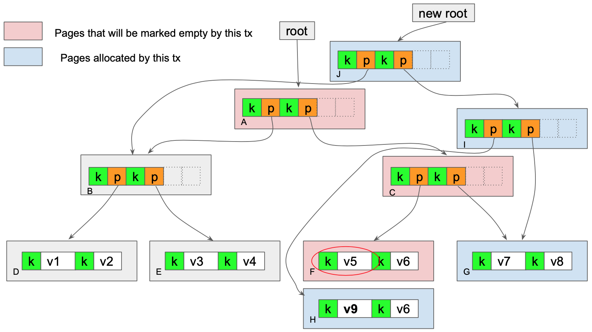
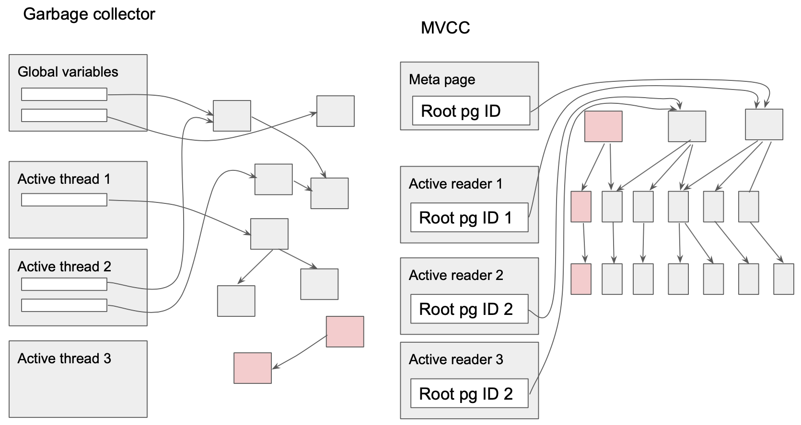
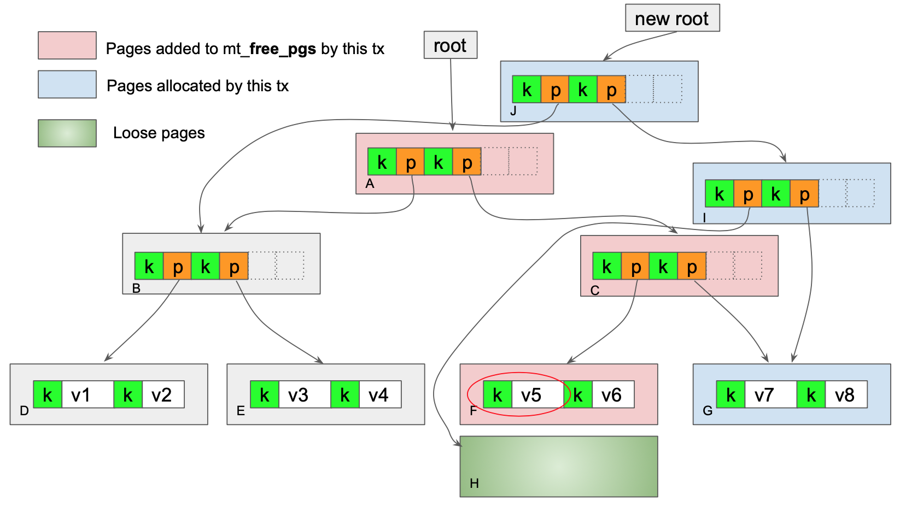

# Freelist

## How modifying the data gives rise to freelist
MDBX supports Multi Version Concurrency Control (MVCC), which is a feature that allows readers of the database "lock in" a view of the database and that that view be "frozen", undisturbed until the reader disconnects. By reader here we understand any transaction (read-only or writable). There is a limitation on how many readers may simultaneously connect, but once allowed to connect, the reader can view the "frozen" image of the database for as long as required. Maintenance of this property puts constraints on how modification of data can be performed. In particular, all modification of data by writeable transactions need to be done using "copy on write" pattern.
For example, lets imagine this state of the database before modifying an element with value **v5**:

To ensure that any reader that is currently looking at the database via the *root* page pointer, or in fact any reader that may come along during the execution of our modifications, sees undisrupted image of the database, our modification must not change any pages that are reachable from the *root* pointer. Therefore, we create a *new root* pointer, and create an alternative B+-tree that will contain previous database image with our modifications applied:

As shown on the picture, this modification will require allocation of four pages (either by increasing the file size, or by recycling previously freed space): `H`, `G`, `I`, `J`, and three pages `A`, `C`, `F` will be marked as potentially recyclable.

The list of these potentially recyclable pages is called freelist. Most of the pages added to the freelist during modifications, cannot be recycled while the writeable transaction is in flight. This is because any readers connecting before the writable transaction commits, will still see the *root* and all the pages reachable from it. This is similar to the problem garbage collector faces when determining unreachable objects. Starting points of reachability analysis for a garbage collector are global variable and stack of active threads. Similarly, the starting point for the MVCC reachability analysis are the *root* pointer (only one global variable) and the root pointers grabbed by any active readers:

## How deleting the data gives rise to freelist (in transaction objects)
Deleting is a type of modification and all said before about modifications apply here. With deletions, however, there is one more interesting case - pages that were allocated during the transaction (for modification) but then subsequently freed by deletions. For example, if, after modification shown above, we decided to delete record with values **v9** and **v6**, we would end up with an empty page. But this is the page we have previously allocated, and it is not reachable from the *root* page pointer, therefore it can be reused straight away. Such pages are called "loose pages":

In the description below, there is a distinction between emptied pages that cannot be recycled yet, and loose pages. There are stored in the different data structures.

In MDBX, data can be deleted in two main ways:
1. **deleting keys from a cursor**
2. **removing an entire table** (DBI)

**Deleting keys from a cursor** may cause rebalancing of the B+-tree, because one of the invariants that need to be maintained in a B+-tree says that all pages, except for the root page, must be at least half-full. So, if deleting keys makes a page less than half-full, rebalancing happens - keys and values are moved between pages. Some of these rebalancing cause some pages become empty.

**Removing an entire table** (DBI) is a simpler operation than deleting keys from a cursor, because it does not require any rebalancing. Any table always starts with its own root page, and pages are never shared between tables. Therefore, removing an entire table requires finding all the pages that belong to that table.

As we see from above, both ways may produce new empty pages. These empty pages are usually in middle of the database file, and we would like to fill them up (later) with the new data, to prevent the database file from growing too fast.

Since any changes to the database can only occur as a result of a writeable transaction, a transaction object should have some transient data structures to keep the list of pages this transaction emptied. At the time of the transaction commit, these structures are converted into persistent form inside the database.
There are two transient data structures in which a transaction object keeps the IDs of emptied pages:
1. `MDBX_IDL mt_free_pgs;` Type `MDBX_IDL` stands for "ID list", and it is a pointer for a list of 8-byte Page IDs, starting with the length of the list at the index 0. Therefore, you can often see `txn->mt_free_pgs[0]` as the expression to take the length of the page ID list. This list is pre-allocated to certain size, and therefore, if something needs to be added, such list sometimes needs to be reallocated and moved.
2. `MDBX_page *mt_loose_pgs;` Type `MDBX_page` is the structure describing page header. At the beginning of any page, there is a space for either page number of a pointer to another page header. Therefore, `mt_loose_pgs` is the head of a linked list of page headers, which is convenient for adding and remove pages one by one.

Conceptually, these two data structures of a transaction object contain the same kind of information - pages emptied by the transaction, but they are kept and maintained in different forms (slice of IDs and linked list of page headers). The reason for this is as follows. Loose pages from `mt_loose_pgs` are allowed to be re-used during the same transaction, whereas the pages from `mt_free_pgs` are not allowed to be re-used. The re-use happens in the function `mdbx_page_alloc`. This distinction about allowed re-use drives the decisions on when emptied pages are added to one list or another. Pages that have been allocated by this current transaction (either from the expansion of the database or from recycling of the freelist), are known not to be accessed by any other transactions. Such pages end up being marked with `P_DIRTY` flag. Therefore, having such flag becomes necessary (but not sufficient) criteria for a page to end up in the `mt_loose_pgs` linked list when emptied.

1. When an entire table is removed, the emptied pages always get added to the `mt_free_pgs`, ostensibly for efficiency. If there are many page IDs that were emptied, it is very unlikely that many of them have been allocated by the current transaction, so they are all added to the `mt_free_pgs`, even those some of them might be eligible for `mt_loose_pgs`. The function where appending to `mt_free_pgs` is performed is `mdbx_drop0`.
2. When rebalancing is performed, if a page has too few entries, and its neighbour page is also just at the threshold or below, the two pages are merged. This merging creates an empty page, and it is added to the `mt_loose_pgs` if it is marked with `P_DIRTY` flag and it is not part of the "special" freelist table `FREE_DBI`. Otherwise, it is added to the `mt_free_pgs`

At the transaction commit, both structures `mt_free_pgs` and `mt_loose_pgs` are effectively merged together and persisted as a record in the "special" freelist table `FREE_DBI`. Such record has transaction IDs as a key, and the value is the encoding of the sorted list of page IDs, 8 byte per ID. Transaction IDs increase monotonously throughout the life of the database, so they can be used as "versions" for the purposes of MVCC (Multi Version Concurrency Control). The function that persists these two data structures is `mdbx_freelist_save`, and it has some nuances that cause performance issues when freelists become large. I will describe the mechanics of this function and the issues later...

## Old pages state in the environment object
Environment object has a field `MDBX_pgstate me_pgstate;`, which is a structure consisting on two elements. These two elements are "aliased" (using `#define` directive) to the name `me_pghead` and `me_pglast` accordingly.

The first element, `me_pghead` is a pointer to the list of page IDs. These are the IDs of pages that can be re-used by the current transaction, if required. Page IDs get into the `me_pghead` list by being read from the beginning of the freelist table `FREE_DBI`. You may remember that the keys in the freelist tables are transaction IDs, or in other words, version numbers, indicating "when" certain page IDs became part of the freelist.

The second element, `me_pglast`, is a number representing the version number (transaction ID), whose freelist entry was read from the `FREE_DBI` table last, and that entry is now added to the `me_pghead` list.

Both elements are only modified during the execution of `mdbx_page_alloc` function. That function tries to search through the old freelists, starting from the oldest one (smallest transaction ID), going to the newer ones, trying to find a run of consecutive pages of desired length. As the search continues, `me_pghead` gets expanded, and `me_pglast` increases.
